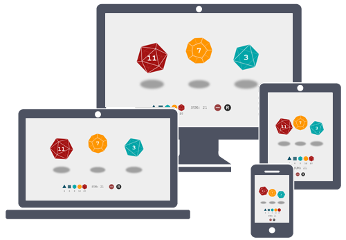

<p align="center">
  
</p>


### Dice Roller
An application that allows you to roll dices virtually.

---

Доступно по следующей ссылке (вероятен высокий пинг): http://18.219.240.23:8081

Приложение реализовано с использованием JS-фреймворка *Phaser*.

#### Инструкция по развертыванию:
- Склонировать проект:
```
git clone https://github.com/Anagrimonia/dice-roller.git
```
- Перейти в корень проекта:
```
cd dice-roller
```
- Развернуть приложение в докер-контейнере:
```
docker-compose up --build -d
```
&nbsp;&nbsp;&nbsp;&nbsp;&nbsp;&nbsp; Или запустить NodeJS-сервер:
```
npm build
npm start
```


#### Какие дополнительные функции (или выход за рамки функции бросания кубика) захотят пользователи такого приложения и почему?

- *Адаптивность дизайна приложения под различные устройства.* \
Большая часть пользователей предпочтет бросать кости, используя мобильный телефон - этот девайс всегда под рукой, чтобы воспользоваться им во время игровой сессии.

- *Возможность выбора костей с нестандартным количеством граней* \
Разные настольные игры требуют разного диапазона рандомных значений.

- *Добавление / удаление игральных костей* \
В некоторых игровых случаях необходимо бросать сразу несколько костей.

- *Отображение общей суммы текущих очков* \
На случай, если костей много, а игроки гуманитарного склада ума.

Рекомендуемые к реализации:

- *Удаление конкретной кости или всех костей с холста* \
Функция, еще не добавленная в приложение.

- *Хранение и отображение истории последних бросков* \
У каждого бывали ситуации, когда приходилось по памяти восстанавливать последние игровые события. История бросков упростит эту задачу.

- *Создание и смена профилей для осуществления "именованных бросков"* \
Дополнение к пункту выше.

- *Разработка мультиплеерного онлайн-режима* \
Чтобы иметь возможность играть по сети.

#### Как бы вы рекомендовали ООО "Подземелья и Драконы" продвигать такое приложение?

Прежде всего, приложение будет пользоваться популярностью среди любителей настольных игр в офлайне. 
Однако, бросать кубики бывает необходимо и во многих онлайн-играх, и в этом случае приложение может выступить в качестве встраиваемого 
готового решения в чей-либо разрабатываемый проект.
